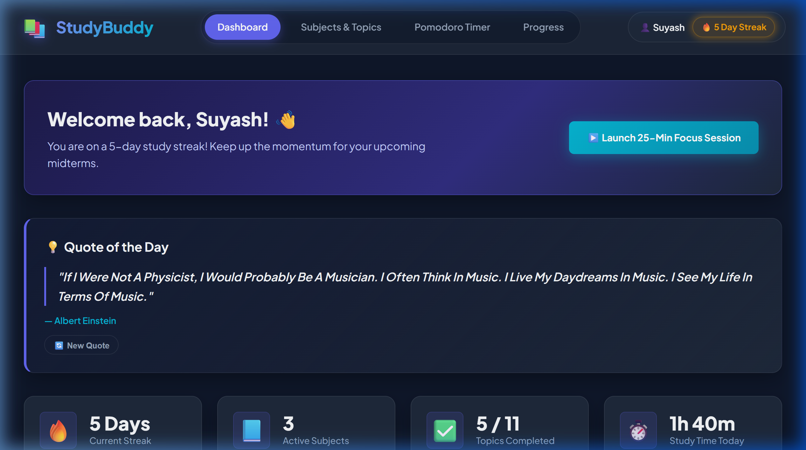
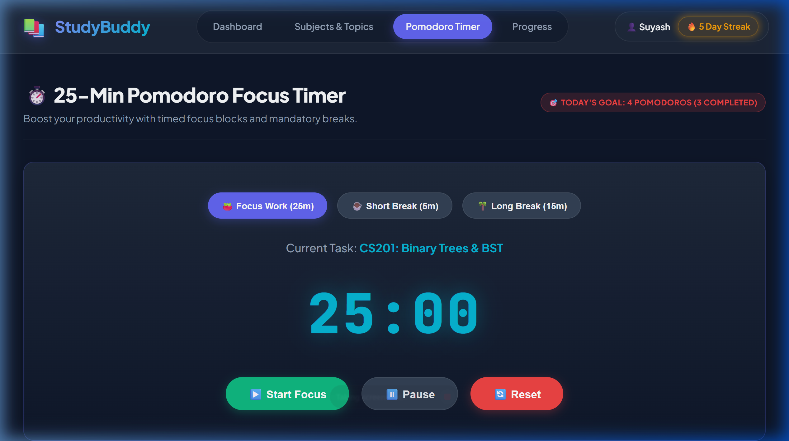
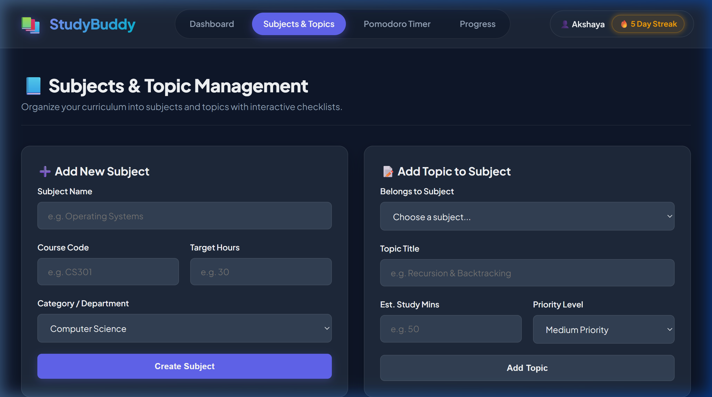
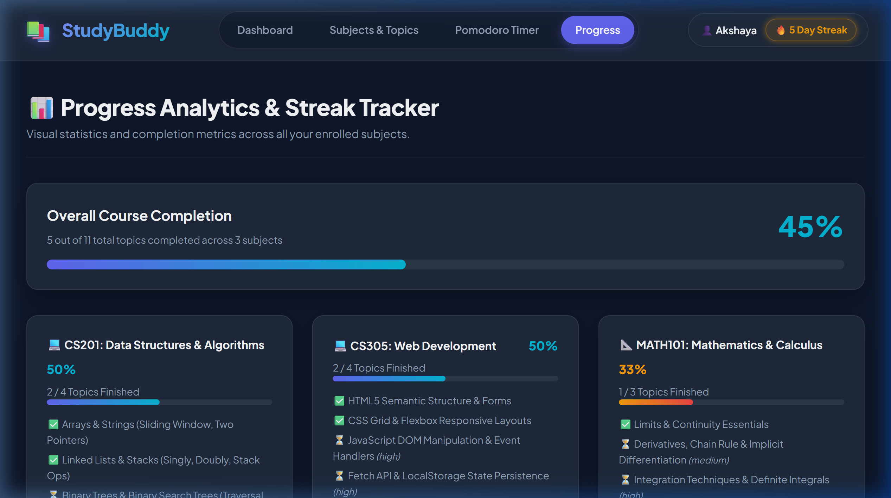

# 📚 StudyBuddy — Personal Study Planner & Pomodoro Tracker

> **Zyora Internship · Team 3**

[](https://zyora-internship-team-3.vercel.app)
[](https://developer.mozilla.org/en-US/docs/Web/HTML)
[](https://developer.mozilla.org/en-US/docs/Web/CSS)
[](https://developer.mozilla.org/en-US/docs/Web/JavaScript)

A zero-dependency, zero-build-step personal study planner. Open `index.html` in any modern browser and it works — everything persists via `localStorage`. No frameworks, no accounts, no server required.

---

## 🌐 Live Demo

**[https://zyora-internship-team-3.vercel.app](https://zyora-internship-team-3.vercel.app)**

---

## ✨ Features

### 📊 Dashboard
- Live study streak counter with glowing fire animation
- 4 stat cards: streak days, active subjects, topics completed, total study time
- **Fetch API — Quote of the Day**: animated loading → success → graceful offline fallback (with retry)
- High-priority topic checklist with live checkbox sync to `localStorage`
- Search & filter topics by keyword, subject, and priority (live as you type)
- Quick-add topic form with validation

### 📘 Subjects & Topics
- Add/delete subjects with course codes, target hours, and categories
- Add/delete topics per subject with priority levels and estimated study time
- Progress bars per subject (live — update on checkbox change)
- Filter topics by keyword and completion status (pending / completed)
- Duplicate code and title prevention

### ⏱️ Pomodoro Timer
- 25-minute focus timer with short (5m) and long (15m) break modes
- Clock changes colour by mode: cyan (work), green (short break), amber (long break)
- Dynamic subject & topic selector populated from `localStorage`
- Auto-start breaks on timer completion (configurable)
- Saves completed sessions to `localStorage` and auto-increments daily streak
- Manual session logger for offline/textbook study
- Session history table (last 10 sessions)

### 📈 Progress Analytics
- Overall completion banner with live progress bar
- Per-subject progress cards with topic breakdown (live from `localStorage`)
- Dynamic achievement badges based on streak + session count + topics completed
- Weekly goal-setting form (target hours + topics + self-reflection notes)
- Date range analytics filter UI

### 📱 Responsive Design (Mobile-First)
- **4 breakpoints**: 900px, 768px, 480px, 360px
- Hamburger navigation menu on ≤ 768px with animated ☰ → ✕ toggle
- 44px minimum touch targets on all interactive elements
- Timer mode buttons & controls stack full-width on small screens
- Form rows collapse to single column on mobile
- Emoji favicon shown on all pages

---

## 📸 Screenshots

| Dashboard | Pomodoro Timer |
|-----------|---------------|
|  |  |

| Subjects & Topics | Progress Analytics |
|-------------------|--------------------|
|  |  |

---

## 🛠 Tech Stack

| Layer | Technology |
|-------|-----------|
| Structure | HTML5 (Semantic elements, ARIA labels) |
| Styling | Vanilla CSS3 (Design tokens, CSS custom properties, Grid, Flexbox) |
| Logic | Vanilla JavaScript ES6+ (`localStorage`, Fetch API, AbortController) |
| Fonts | [Plus Jakarta Sans](https://fonts.google.com/specimen/Plus+Jakarta+Sans) + [JetBrains Mono](https://fonts.google.com/specimen/JetBrains+Mono) via Google Fonts |
| Hosting | Vercel (static deploy, zero config) |

**No frameworks. No bundlers. No npm install.** Pure web platform APIs only.

---

## 🗂 Project Structure

```
zyora-intrnship-team-3/
├── index.html            # Dashboard (Suyash)
├── pages/
│   ├── timer.html        # Pomodoro Timer (Suyash)
│   ├── subjects.html     # Subjects & Topics (Akshaya)
│   └── progress.html     # Progress Analytics (Akshaya)
├── css/
│   └── style.css         # Shared design system & all responsive styles
├── js/
│   ├── script.js         # Shared: localStorage, toast, validation, mobile nav
│   ├── dashboard.js      # Dashboard: stats, priority list, search, fetch quote
│   ├── subjects.js       # Subjects CRUD, topic CRUD, filter, dropdowns
│   ├── timer.js          # Timer engine, dynamic dropdowns, session logging
│   └── progress.js       # Progress cards, streak, badges, weekly goals
└── images/               # Screenshots & assets
```

---

## 👥 Team & Responsibilities

| Member | Pages | Key Deliverables |
|--------|-------|-----------------|
| **Suyash Srivastava** | `index.html` · `pages/timer.html` | Dashboard stats & search · Fetch API Quote of the Day · Pomodoro timer engine · Timer settings & session log |
| **A. Akshaya** | `pages/subjects.html` · `pages/progress.html` | Subject/topic CRUD with validation · Progress bars · Streak & achievement badges · Weekly goal form |

---

## 🚀 Run Locally

**Option 1 — Just open the file (simplest):**
```
Double-click index.html in your file explorer
```

> ⚠️ Some browsers block `localStorage` on bare `file://` URLs. Use Option 2 if so.

**Option 2 — Static server (recommended):**
```bash
# Using npx serve (Node.js required)
npx serve .

# Or Python's built-in server
python -m http.server 8000
```
Then visit `http://localhost:8000`

**Option 3 — VS Code Live Server:**
Install the [Live Server extension](https://marketplace.visualstudio.com/items?itemName=ritwickdey.LiveServer), right-click `index.html` → *Open with Live Server*.

---

## 💾 Data Model

All data is stored in `localStorage` under these keys:

| Key | Contents |
|-----|---------|
| `sb_subjects` | Array of subjects with nested topics, priorities, and completion state |
| `sb_sessions` | Array of logged study sessions (Pomodoro + manual) |
| `sb_streak` | Current study streak (integer, days) |
| `sb_last_study_date` | Last date a session was completed (for streak logic) |
| `sb_timer_prefs` | Saved timer durations, subject, topic, and auto-break setting |
| `sb_weekly_goal` | Target hours, target topics, and reflection notes |

To **reset all data**: open the browser console and run `localStorage.clear()`, then refresh.

---

## 🌐 External API

| API | Usage | Fallback |
|-----|-------|---------|
| `dummyjson.com/quotes/random` | Quote of the Day on Dashboard | 5 built-in inspirational quotes shown if offline or API times out |

The app works **fully offline** except for the Quote card. An 8-second `AbortController` timeout and graceful error state ensure a smooth experience without internet.

---

## 🚧 Known Limitations

- **Date-based session filtering** on the Progress page is UI-only — the data model does not timestamp individual sessions, so filtering by date range shows a toast but does not yet re-render data.
- **Streak reset** — the counter only increments; it does not automatically reset to 0 after a missed day (would need a background check against `sb_last_study_date` on every page load).
- **Chart visualizations** — progress is shown as animated bar fills, not SVG/Canvas charts.
- **User profiles** — names are hardcoded per page; no settings page to change them.
- **Export / sharing** — no PDF export or shareable progress link.

---

## 📄 License

MIT — free to use, fork, and learn from.

---

*Built with 💜 by Suyash Srivastava & A. Akshaya · Zyora Internship Team 3*
